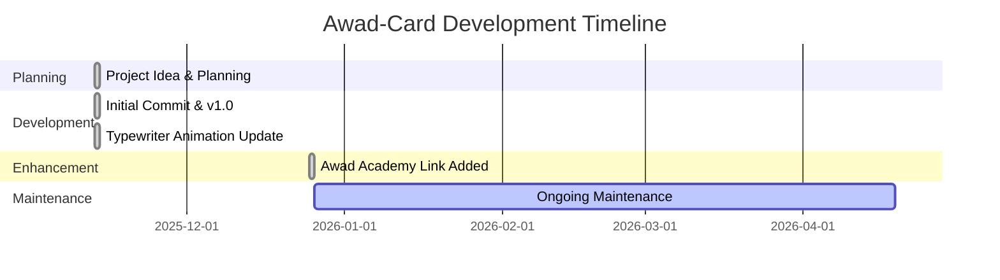
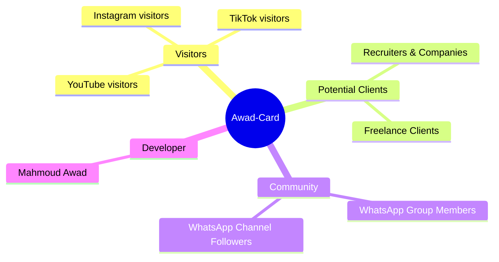
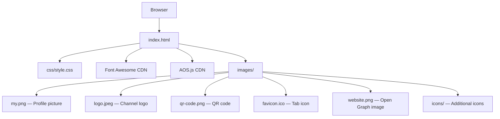
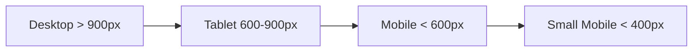
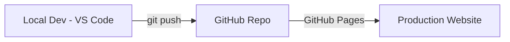
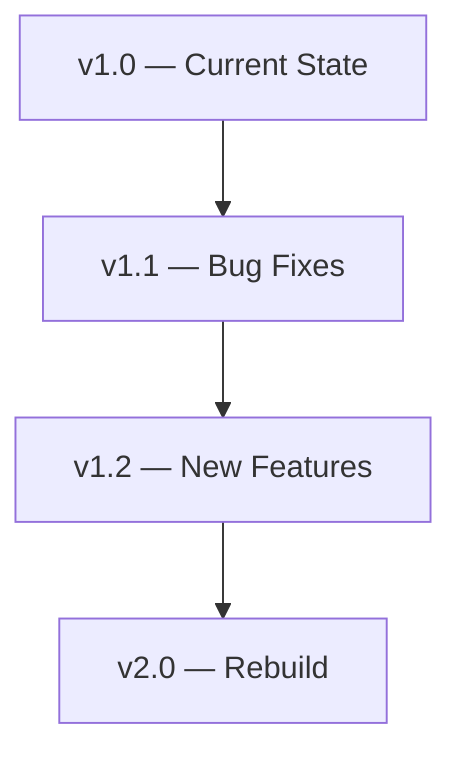

# 📋 Awad-Card — SDLC Project Documentation
# Full Project Analysis Following the Software Development Life Cycle

---

> **Note:** This document provides a complete breakdown of the **Awad-Card** project following the **SDLC (Software Development Life Cycle)** methodology.
> Anyone reading this file will understand the project from scratch — the idea, design, implementation, and deployment.

---

## 📑 Table of Contents

1. [Phase 1: Planning](#phase-1-planning)
2. [Phase 2: Requirements Analysis](#phase-2-requirements-analysis)
3. [Phase 3: System Design](#phase-3-system-design)
4. [Phase 4: Implementation](#phase-4-implementation)
5. [Phase 5: Testing](#phase-5-testing)
6. [Phase 6: Deployment](#phase-6-deployment)
7. [Phase 7: Maintenance & Evolution](#phase-7-maintenance--evolution)

---

## Phase 1: Planning

### 1.1 Project Overview

| Field | Details |
|---|---|
| **Project Name** | Awad-Card (Personal Digital Business Card) |
| **Owner** | Mahmoud Awad |
| **Project Type** | Static Website — No Backend |
| **Purpose** | A professional digital business card that aggregates all personal links and information in one place |
| **Target Audience** | Social media visitors, potential clients, recruiters, students |
| **Start Date** | November 13, 2025 |
| **Last Update** | December 25, 2025 |
| **Repository** | [github.com/AwadCoding/awad-card](https://github.com/AwadCoding/awad-card) |

### 1.2 Project Goals

```
✅ Create a digital business card as a replacement for paper cards
✅ Aggregate all social media and contact links in one place
✅ Showcase technical skills visually
✅ Fully responsive design across all devices
✅ Engaging user experience with smooth animations
✅ Easy sharing via QR Code
```

### 1.3 Project Scope

| ✅ In-Scope | ❌ Out-of-Scope |
|---|---|
| Single-page containing all information | Admin dashboard |
| Links to all social media accounts | Login/authentication system |
| Technical skills showcase | Database |
| Interactive About Me flip card | Direct contact form |
| QR Code for quick sharing | Multi-language support |
| Fully responsive design | Dark/Light mode toggle |

### 1.4 Timeline



### 1.5 Version History (Git Log)

| Date | Commit Hash | Description |
|---|---|---|
| 2025-11-13 | `4d1bf60` | Initial commit — project creation |
| 2025-11-13 | `807350a` | v1.0 — first complete release |
| 2025-11-13 | `f8b6c70` | Updated typewriter animation |
| 2025-12-25 | `82834f7` | Added Awad Academy link |

---

## Phase 2: Requirements Analysis

### 2.1 Functional Requirements

| # | Requirement | Priority | Status |
|---|---|---|---|
| FR-01 | Display a professional profile picture | High | ✅ Complete |
| FR-02 | Display name and job title | High | ✅ Complete |
| FR-03 | Typewriter effect to alternate between roles | Medium | ✅ Complete |
| FR-04 | Social media links (7 links) | High | ✅ Complete |
| FR-05 | Technical skills showcase (8 skills) | High | ✅ Complete |
| FR-06 | Links & resources section (WhatsApp) | Medium | ✅ Complete |
| FR-07 | "About Me" card with 3D flip effect | Medium | ✅ Complete |
| FR-08 | Link to projects page (Portfolio) | High | ✅ Complete |
| FR-09 | Link to contact section | High | ✅ Complete |
| FR-10 | QR Code for quick sharing | Medium | ✅ Complete |
| FR-11 | Footer with copyright notice | Low | ✅ Complete |

### 2.2 Non-Functional Requirements

| # | Requirement | Details | Status |
|---|---|---|---|
| NFR-01 | **Performance** | Page load under 3 seconds | ✅ |
| NFR-02 | **Responsiveness** | Works on Mobile, Tablet, Desktop | ✅ |
| NFR-03 | **Compatibility** | Works on Chrome, Firefox, Safari, Edge | ✅ |
| NFR-04 | **SEO** | Meta tags for search engine visibility | ✅ |
| NFR-05 | **UX/UI** | Smooth animations with AOS Library | ✅ |
| NFR-06 | **Accessibility** | Alt text for images | ⚠️ Partial |

### 2.3 Stakeholder Analysis



---

## Phase 3: System Design

### 3.1 Architecture

```
Type:    Single-Page Static Website
Pattern: Component-based CSS Layout
Hosting: GitHub Pages
```



### 3.2 File Structure

```
Awad-card/
├── index.html            ← Main and only page (8,242 bytes)
├── css/
│   └── style.css         ← All styles (13,535 bytes / 671 lines)
├── images/
│   ├── my.png            ← Profile picture (941 KB)
│   ├── logo.jpeg         ← Channel logo (29 KB)
│   ├── qr-code.png       ← QR code (133 KB)
│   ├── website.png       ← OG/Preview image (206 KB)
│   ├── favicon.ico       ← Tab icon (15 KB)
│   └── icons/
│       └── notion.png    ← Notion icon (1 KB)
├── .gitattributes        ← Git configuration
└── .git/                 ← Internal Git files
```

### 3.3 Design System

#### Color Palette

```css
/* ====== Primary Colors ====== */
--bg-color:           linear-gradient(1deg, #02754b, #4C5F4E, #FAF8F5)
--text-color:         #003e1f        /* Dark green — primary text */
--text-color-scend:   #2e8b57        /* Light green — secondary text */
--text-color-hover:   #ffffff        /* White — on hover */

/* ====== Button Colors ====== */
--button-coolor:      #004d2a        /* Dark green — button background */
--button-hover-color: #2e8b57        /* Light green — button hover */
--button-text-color:  #ffffff        /* White — button text */

/* ====== Card Colors ====== */
--card-bg-color:      rgba(255,255,255,0.1)   /* Semi-transparent background */
--card-border-color:  rgba(255,255,255,0.2)   /* Transparent border */
```

| Color | Hex Code | Usage |
|---|---|---|
| Emerald Green | `#02754b` | Main gradient background |
| Gray Green | `#4C5F4E` | Middle gradient |
| Cream White | `#FAF8F5` | Gradient end |
| Dark Forest Green | `#003e1f` | Text |
| Sea Green | `#2e8b57` | Secondary text |
| Dark Green | `#004d2a` | Buttons |

#### Typography

| Font | Usage | Type |
|---|---|---|
| **Fugaz One** | General text and subheadings | Sans-Serif — bold and personal |
| **Caveat** | Name `<h2>` + Typewriter text | Cursive — natural handwriting |

#### Icons System

Each social media icon uses its official brand color:

| Icon | Color | CSS Variable |
|---|---|---|
| Website | `#ff6600` Orange | `--icon-website` |
| GitHub | `#1b1b1b` Black | `--icon-github` |
| LinkedIn | `#0a66c2` Blue | `--icon-linkedin` |
| TikTok | `#1b1b1b` Black | `--icon-tiktok` |
| YouTube | `#ff0000` Red | `--icon-youtube` |
| Instagram | `#e1306c` Pink | `--icon-instagram` |
| Academy | `#00fa9a` Light Green | `--icon-academy` |

#### Technical Skills Displayed

| Skill | Color | CSS Variable |
|---|---|---|
| HTML5 | `#e34f26` | `--icon-html` |
| CSS3 | `#264de4` | `--icon-css` |
| JavaScript | `#f0db4f` | `--icon-js` |
| Bootstrap | `#563d7c` | `--icon-bootstrap` |
| React | `#61dbfb` | `--icon-react` |
| Vue.js | `#42b883` | `--icon-vue` |
| Sass | `#c69` | `--icon-sass` |
| Git | `#f34f29` | `--icon-git` |

### 3.4 Page Sections Layout

```mermaid
graph TB
    subgraph "index.html — Page Structure"
        A["Profile Image"] --> B
        B["Name: mahmoud awad"] --> C
        C["Job Title: Typewriter Effect"] --> D
        D["Social Media Links - 7 links"] --> E
        E["Technical Skills - 8 skills"] --> F
        F["Links & Resources - WhatsApp"] --> G
        G["About Me — 3D Flip Card"] --> H
        H["My Projects - Portfolio link"] --> I
        I["Contact Me - Contact link"] --> J
        J["QR Code for sharing"] --> K
        K["Footer - Copyright"]
    end
```



### 3.5 Responsive Design Strategy



| Breakpoint | Changes |
|---|---|
| **> 900px (Desktop)** | Card width `60vw` · Image inside card `imgbox-desktop` · About Card = hover flip |
| **<= 900px (Tablet/Mobile)** | Card width `90vw` · Image above card `imgbox-mobile` · About Card = always flipped (showing back) · Vertical layout |
| **<= 600px (Small Mobile)** | Skills icons smaller `1.6em` · Bounce animation on icons · Swing animation on social links · Resources = single column |
| **<= 400px (Extra Small)** | Name `2.5em` instead of `3em` · Typewriter `1.2em` |

> **Smart technique:** The profile image exists twice in HTML — once inside the card (Desktop) and once above it (Mobile).
> Each version is shown/hidden based on screen size using CSS `display: none/flex`.

---

## Phase 4: Implementation

### 4.1 Technology Stack

| Layer | Technology | Version | Purpose |
|---|---|---|---|
| **Structure** | HTML5 | - | Page markup |
| **Styling** | CSS3 (Vanilla) | - | All styles and responsiveness |
| **Icons** | Font Awesome | 6.4.0 | Social and skill icons |
| **Animation** | AOS.js | 2.3.4 | Scroll-triggered animations |
| **Fonts** | Google Fonts | - | Caveat + Fugaz One fonts |
| **Version Control** | Git + GitHub | - | Source control |
| **Hosting** | GitHub Pages | - | Free static hosting |

### 4.2 External Dependencies (CDN)

```html
<!-- Google Fonts -->
<link href="https://fonts.googleapis.com/css2?family=Caveat:wght@400..700&family=Fugaz+One&display=swap">

<!-- Font Awesome 6.4.0 -->
<link href="https://cdnjs.cloudflare.com/ajax/libs/font-awesome/6.4.0/css/all.min.css">

<!-- AOS.js 2.3.4 -->
<link href="https://cdnjs.cloudflare.com/ajax/libs/aos/2.3.4/aos.css">
<script src="https://cdnjs.cloudflare.com/ajax/libs/aos/2.3.4/aos.js"></script>
```

> **Warning:** All dependencies are loaded from external CDNs. If a CDN goes down, icons and animations will be affected.
> **Recommendation:** Store local copies as a fallback.

### 4.3 Animation System

#### A) AOS.js — Scroll-Triggered Animations

```javascript
AOS.init({
    duration: 1200,  // Each animation lasts 1.2 seconds
});
```

| Element | Effect | Delay |
|---|---|---|
| Profile image | `zoom-in` | 400ms |
| Main card | `zoom-in` | 500ms |
| Name | `zoom-in` | 800ms |
| Job title | `zoom-in` | 900ms–1000ms |
| Social icons | `zoom-out` | 1000ms–1600ms (staggered) |
| Skills section | `zoom-in` | 1600ms |
| About Card | `zoom-in` | Default |
| QR Code | `zoom-in` | Default |

#### B) CSS Animations — Custom Keyframes

**1. Typewriter Effect (Role Switching):**
```
"Front-End Developer" fades in then out, then "Content Creator" fades in
Full cycle = 6 seconds — repeats infinitely
```
- Uses `opacity` only (not a real typing effect)
- First text starts visible, second text starts hidden
- Switch occurs at the 40%–50% mark of the cycle

**2. Social Icons Loop (Mobile only):**
```css
/* Gentle swing rotate(+/-10deg) — 5 second cycle */
```

**3. Skills Icons Bounce (Mobile only):**
```css
/* Upward bounce translateY(-10px) — 5 second cycle */
```

**4. About Card Flip:**
```css
/* 3D effect with perspective: 1000px */
/* Desktop: hover triggers rotateY(180deg) */
/* Mobile: permanently flipped to show the back */
```

**5. Icon Hover Effect (All screen sizes):**
```css
/* scale(1.2) + rotate(10deg) + text-shadow glow */
```

### 4.4 Component Design

#### Component 1: Profile Section

```
┌──────────────────────────────────┐
│       Circular Profile Image     │
│      ┌─────────────────┐        │
│      │    15em x 15em   │        │
│      │  border-radius   │        │
│      │     50%          │        │
│      └─────────────────┘        │
│                                  │
│      mahmoud awad                │
│  (Caveat, 3em, handwriting)      │
│                                  │
│   Front-End Developer            │
│   <-- typewriter swap -->        │
│   Content Creator                │
└──────────────────────────────────┘
```

#### Component 2: Social Links Bar

```
┌──────────────────────────────────────────────────────┐
│  Web  Git  Link  YT   TT   IG  Academy              │
│                                                      │
│  Each icon: 24px · gap: 20px                         │
│  Hover: scale(1.2) rotate(10deg) + glow              │
│  Mobile: continuous swing every 5 seconds             │
└──────────────────────────────────────────────────────┘
```

#### Component 3: Skills Section

```
┌──────────────────────────────────────────┐
│              Skills                      │
│                                          │
│  HTML5  CSS3  JS  Bootstrap              │
│  React  Vue  Sass  Git                   │
│                                          │
│  Icons at 2em · each with brand color    │
│  Mobile: upward bounce animation         │
└──────────────────────────────────────────┘
```

#### Component 4: About Me Flip Card

```
FRONT:                              BACK:
┌──────────────────────────┐    ┌──────────────────────────┐
│                          │    │                          │
│     About Me             │    │   Who Am I?              │
│                          │    │                          │
│  (Desktop: Hover to      │ -> │  I'm Mahmoud Awad —      │
│   flip)                  │    │  Front-End Developer &    │
│                          │    │  Content Creator...       │
│  (Mobile: Always         │    │                          │
│   showing back)          │    │  [Read More ->]           │
│                          │    │                          │
└──────────────────────────┘    └──────────────────────────┘

            3D Flip: rotateY(180deg)
            perspective: 1000px
            transition: 0.8s
```

#### Component 5: Links & Resources (Grid)

```
┌──────────────────────────────────────────────┐
│           Links & Resources                  │
│                                              │
│  ┌──────────────┐    ┌──────────────┐        │
│  │  WhatsApp     │    │  WhatsApp    │        │
│  │    Group      │    │   Channel    │        │
│  │              │    │              │        │
│  │ [Join Group] │    │ [Join Chan]  │        │
│  └──────────────┘    └──────────────┘        │
│                                              │
│  Grid: auto-fit, minmax(200px, 1fr)          │
│  Mobile: single column                       │
└──────────────────────────────────────────────┘
```

### 4.5 Advanced CSS Techniques Used

| Technique | Usage | Lines in style.css |
|---|---|---|
| **CSS Custom Properties** | Full color system with 30+ variables | 7–43 |
| **CSS Grid** | Card layout + Resources grid | 118–119, 427–434 |
| **Flexbox** | Content alignment across sections | Multiple |
| **Backdrop Filter** | Glass/Blur effect on the card | 124 |
| **3D Transforms** | Flip Card with `preserve-3d` | 481–531 |
| **CSS Keyframe Animations** | Typewriter + Bounce + Swing | 202–234, 318–332, 399–409 |
| **Responsive Design** | 4 Breakpoints + Mobile-First Animations | 235, 313, 391, 448, 455, 542, 548, 611, 662 |
| **Custom Scrollbar** | Scrollbar styled with project colors | 97–113 |
| **Text Selection** | Custom color on text selection | 45–48 |
| **Lazy Loading** | `loading="lazy"` on images | HTML |

---

## Phase 5: Testing

### 5.1 Browser Compatibility Testing

| Browser | Desktop | Mobile | Status |
|---|---|---|---|
| Chrome | ✅ | ✅ | Works (supports all features) |
| Firefox | ✅ | ✅ | Works (supports all features) |
| Safari | ✅ | ✅ | Works (Webkit prefixes needed for backface) |
| Edge | ✅ | ✅ | Works (Chromium-based) |

### 5.2 Responsive Testing

| Device | Width | Result |
|---|---|---|
| Desktop (Full HD) | 1920px | ✅ Card at 60vw — excellent |
| Laptop | 1366px | ✅ Works normally |
| Tablet | 768px | ✅ Switches to vertical layout |
| Mobile (iPhone 12) | 390px | ✅ Image above card + animations |
| Small Mobile | 320px | ✅ Text adapts to available space |

### 5.3 Performance Review

| Metric | Value | Notes |
|---|---|---|
| HTML size | 8.2 KB | ✅ Very lightweight |
| CSS size | 13.5 KB | ✅ Acceptable |
| Profile image size | 941 KB | ⚠️ Large — should be compressed |
| CDN resources | 3 libraries | ✅ Loaded from fast CDN |
| Lazy Loading | Yes | ✅ Applied to images |

> **Performance tip:** `my.png` is 941 KB — it is recommended to compress it to under 200 KB using WebP format or a tool like TinyPNG.

### 5.4 SEO Audit

| Element | Status | Details |
|---|---|---|
| `<title>` | ✅ | `Awad-card` — short but clear |
| `<meta description>` | ✅ | Present with personal description |
| `<meta keywords>` | ✅ | Relevant keywords included |
| `<meta author>` | ✅ | `mahmoud awad` |
| `<meta image>` | ✅ | `images/website.png` |
| Favicon | ✅ | `images/favicon.ico` |
| Alt Text | ⚠️ | Present but some values are too generic |
| Semantic HTML | ⚠️ | Uses `<main>` but lacks `<section>`, `<nav>`, `<header>`, `<footer>` |
| Open Graph Tags | ❌ | Missing (og:title, og:image, etc.) |
| `<h1>` | ❌ | Missing — starts from `<h2>` |

### 5.5 Known Issues

| # | Issue | Severity | Details |
|---|---|---|---|
| BUG-01 | Typo in class name | Low | `class="contenier"` instead of `container` |
| BUG-02 | Extra quotation mark in HTML | Low | `<div class="contenier" ">` — extra `"` |
| BUG-03 | Stray semicolon in CSS | Low | Line 128 in style.css — lone `;` |
| BUG-04 | Duplicate `justify-content` in CSS | Low | Lines 346–347 — `justify-content` declared twice |
| BUG-05 | Nested Media Queries | Low | `@media 1200px` contains `@media 900px` — should be separated |
| BUG-06 | Missing `<h1>` element | Medium | Violates SEO best practices — starts from `<h2>` |
| BUG-07 | Large image file size | Medium | `my.png` = 941 KB — slows down page load |

---

## Phase 6: Deployment

### 6.1 Deployment Environment



| Setting | Details |
|---|---|
| **Platform** | GitHub Pages (Free Hosting) |
| **Repository** | `https://github.com/AwadCoding/awad-card` |
| **Live URL** | `https://awadcoding.github.io/awad-card/` |
| **Branch** | `main` (only branch) |
| **Deploy Method** | Automatic on `git push` to `main` |
| **SSL** | ✅ Free HTTPS from GitHub |

### 6.2 Deployment Workflow

```
1. Edit code locally in VS Code
2. git add .
3. git commit -m "describe the change"
4. git push origin main
5. GitHub Pages builds the site automatically
6. Site updates within 1–2 minutes
```

### 6.3 Git Configuration

| Setting | Value |
|---|---|
| Remote | `origin` -> `https://github.com/AwadCoding/awad-card.git` |
| Branch | `main` (only) |
| `.gitattributes` | `* text=auto` (auto line-ending normalization) |

---

## Phase 7: Maintenance & Evolution

### 7.1 Recommended Improvements

#### High Priority

| # | Improvement | Details |
|---|---|---|
| IMP-01 | **Compress images** | Convert `my.png` from 941 KB to WebP (~100 KB) |
| IMP-02 | **Fix HTML issues** | Fix `class="contenier"` typo and the extra quotation mark |
| IMP-03 | **Add `<h1>` element** | Add a visible or visually-hidden `<h1>` for SEO |
| IMP-04 | **Add Open Graph tags** | Add `og:title`, `og:description`, `og:image` for social media sharing |

#### Medium Priority

| # | Improvement | Details |
|---|---|---|
| IMP-05 | **Semantic HTML** | Use `<section>`, `<nav>`, `<header>`, `<footer>` instead of `<div>` |
| IMP-06 | **Accessibility** | Add `aria-labels` and improve `alt` text descriptions |
| IMP-07 | **Dark Mode** | Add a toggle button for dark/light theme switching |
| IMP-08 | **CDN Fallback** | Store local copies of Font Awesome and AOS.js |

#### Low Priority

| # | Improvement | Details |
|---|---|---|
| IMP-09 | **CSS Cleanup** | Remove duplicates and organize Media Queries |
| IMP-10 | **Reduced Motion** | Add `prefers-reduced-motion` for users who prefer less animation |
| IMP-11 | **Analytics** | Add Google Analytics to track visits |
| IMP-12 | **PWA Support** | Convert the site into an installable Progressive Web App |

### 7.2 Future Roadmap



- **v1.0** ✅ Fully working digital business card
- **v1.1** Bug fixes + Image optimization + SEO improvements
- **v1.2** Dark Mode + Open Graph + Semantic HTML
- **v2.0** JavaScript additions + Theme system + Contact Form + PWA

### 7.3 How to Modify

```bash
# 1. Clone the project
git clone https://github.com/AwadCoding/awad-card.git

# 2. Open the project
cd awad-card
code .

# 3. Key files
# index.html     <- Edit content
# css/style.css  <- Edit styles
# images/        <- Add or change images

# 4. Preview
# Open index.html directly in a browser
# Or use Live Server extension in VS Code

# 5. Push changes
git add .
git commit -m "describe the change"
git push origin main
```

---

## Executive Summary

```
┌─────────────────────────────────────────────────────────────────┐
│                    Awad-Card — Project Summary                  │
├─────────────────────────────────────────────────────────────────┤
│                                                                 │
│  Type: Static Single-Page Website (Digital Business Card)       │
│  Stack: HTML5 + CSS3 + AOS.js + Font Awesome                   │
│  Files: 2 code files + 6 images                                │
│  Design: Glassmorphism + 3D Flip + Typewriter + Gradient       │
│  Responsive: 4 Breakpoints (900, 600, 400px)                   │
│  Theme: Emerald Green (Nature Theme)                            │
│  Hosting: GitHub Pages — free and automatic                     │
│  Performance: Lightweight (~1.3 MB total) — images need         │
│               compression                                       │
│  SEO: Basic — needs Open Graph + h1 + Semantic HTML             │
│  Git History: 4 commits — stable project                        │
│                                                                 │
│  Overall Status: Complete and fully functional project           │
│  with significant room for improvement in SEO and performance   │
│                                                                 │
└─────────────────────────────────────────────────────────────────┘
```

---

> **Last updated:** April 19, 2026
> **Generated by:** Antigravity AI Assistant
> **Purpose:** Comprehensive project documentation following the SDLC methodology
